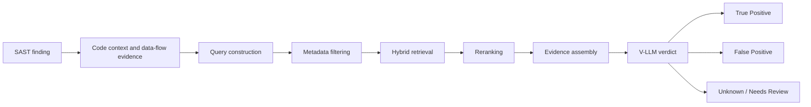

# NGHIÊN CỨU XÂY DỰNG KNOWLEDGE BASE HỖ TRỢ V-LLM GIẢM FALSE POSITIVE TRONG HỆ THỐNG MULTI-AGENT SAST

**Người thực hiện:** Nguyễn Như Yến Phương

**Ngày báo cáo:** 30/07/2026

## 1. Tóm tắt

Hiện tại, công ty đang sử dụng một hệ thống multi-agent Static Application Security Testing (SAST) kết hợp với Vulnerability Large Language Model (V-LLM) để phát hiện và đánh giá các lỗ hổng trong mã nguồn. Tuy nhiên, V-LLM hiện tại còn thiếu kiến thức chuyên biệt về bảo mật phần mềm, dễ hallucinate trong quá trình phân tích và đưa ra nhiều kết quả False Positive.

Báo cáo này nghiên cứu các loại tri thức cần thiết để xây dựng một Security Knowledge Base (KB), bao gồm: vulnerability taxonomy, bug pattern, source, sink, sanitizer, propagator, điều kiện khai thác, PoC, bản vá, ví dụ code an toàn và không an toàn, cùng tri thức riêng của từng ngôn ngữ và framework.

Báo cáo đồng thời đề xuất kiến trúc Retrieval-Augmented Generation (RAG) nhằm truy xuất các tri thức liên quan và cung cấp chúng cho V-LLM trong quá trình verdict. Mục tiêu của hệ thống không chỉ là bổ sung thêm thông tin cho model, mà còn giúp model kiểm chứng đường khai thác, nhận diện các cơ chế bảo vệ và từ chối kết luận khi chưa có đủ bằng chứng.

## 2. Bối cảnh bài toán

SAST là phương pháp phân tích mã nguồn mà không cần thực thi chương trình nhằm phát hiện các vấn đề liên quan đến bảo mật, chất lượng và tính đúng đắn của phần mềm.

Một hệ thống SAST truyền thống thường sử dụng:

- Pattern matching.
- Phân tích Abstract Syntax Tree (AST).
- Phân tích Control Flow Graph (CFG).
- Phân tích call graph.
- Data-flow analysis.
- Taint analysis.
- Các security rule được xây dựng thủ công.

Việc kết hợp Large Language Model với SAST giúp hệ thống có khả năng giải thích finding, suy luận dựa trên ngữ cảnh và phân tích các đoạn code phức tạp hơn. Tuy nhiên, model có thể đưa ra kết luận không chính xác khi:

- Không có đủ code context.
- Không hiểu semantic của framework hoặc thư viện.
- Không biết API nào là source, sink hoặc sanitizer.
- Không phân biệt được code nguy hiểm với code chỉ có hình thức giống lỗ hổng.
- Không biết các điều kiện cần để lỗ hổng có thể bị khai thác.
- Không có các ví dụ False Positive để đối chiếu.
- Suy diễn thêm các data-flow hoặc control-flow không tồn tại.

Do đó, cần xây dựng một KB chuyên biệt về bảo mật mã nguồn và tích hợp KB này với V-LLM thông qua RAG.

## 3. Mục tiêu

Mục tiêu của nghiên cứu gồm:

1. Xác định những loại tri thức cần thiết để V-LLM phân tích vulnerability.
2. Xác định các nguồn dữ liệu có thể thu thập từ Internet.
3. Đề xuất cấu trúc dữ liệu phù hợp cho Security KB.
4. Đề xuất kiến trúc RAG phục vụ quá trình verdict.
5. Đề xuất phương pháp đánh giá khả năng giảm False Positive.
6. Xây dựng phạm vi MVP có thể triển khai trong giai đoạn đầu.

## 4. Nguyên tắc verdict vulnerability

Một đoạn code sử dụng API nguy hiểm chưa đủ để kết luận rằng code tồn tại vulnerability. Model cần chứng minh được một đường khai thác hoàn chỉnh.

Có thể khái quát điều kiện của một True Positive như sau:

```
True Positive =
    attacker-controlled source
AND reachable execution path
AND unsafe data/control flow
AND dangerous sink
AND required exploitability conditions
AND no effective sanitizer or guard
AND security impact
```

Trong đó:

- **Attacker-controlled source:** Attacker có thể kiểm soát dữ liệu đầu vào.
- **Reachable path:** Đoạn code có thể được thực thi trong môi trường thực tế.
- **Unsafe flow:** Dữ liệu nguy hiểm được truyền qua chương trình mà chưa được xử lý an toàn.
- **Dangerous sink:** Dữ liệu đi đến một thao tác nhạy cảm.
- **Exploitability conditions:** Các điều kiện cần thiết để khai thác đều tồn tại.
- **No effective sanitizer:** Không có validation, encoding hoặc cơ chế bảo vệ phù hợp.
- **Security impact:** Việc khai thác có thể gây ảnh hưởng đến confidentiality, integrity hoặc availability.

Verdict nên có ba trạng thái:

- **True Positive:** Có đủ bằng chứng về đường khai thác.
- **False Positive:** Có bằng chứng cho thấy một điều kiện cần không tồn tại hoặc đã có cơ chế bảo vệ hiệu quả.
- **Unknown/Needs Review:** Chưa có đủ bằng chứng để kết luận.

Trạng thái Unknown rất quan trọng để tránh model tự suy đoán khi thiếu code context.

## 5. Những loại tri thức cần có trong Knowledge Base

### 5.1. Vulnerability taxonomy

KB cần chứa hệ thống phân loại vulnerability dựa trên:

- CWE.
- CAPEC.
- OWASP Top 10.
- Ngôn ngữ lập trình.
- Framework.
- Loại ứng dụng.
- Root cause.
- Security impact.

Với mỗi loại vulnerability, cần lưu:

- Tên và mô tả.
- Nguyên nhân gốc.
- Điều kiện xuất hiện.
- Phương pháp phát hiện.
- Hậu quả bảo mật.
- Biện pháp khắc phục.
- Các vulnerability liên quan.

### 5.2. Bug pattern

Bug pattern mô tả cấu trúc code thường dẫn đến vulnerability.

Ví dụ:

```
SQL Injection:
untrusted input
→ string concatenation
→ SQL execution

Command Injection:
untrusted input
→ command construction
→ shell execution

Path Traversal:
untrusted path
→ path construction
→ file access
without canonicalization or boundary checking
```

Bug pattern nên được lưu dưới cả hai dạng:

- Mô tả bằng ngôn ngữ tự nhiên.
- Biểu diễn có cấu trúc dựa trên API, AST hoặc data flow.

### 5.3. Source

Source là nơi dữ liệu không tin cậy đi vào chương trình.

Một số source phổ biến:

- HTTP query parameters.
- Request body.
- HTTP header.
- Cookie.
- File upload.
- Message queue.
- Command-line argument.
- Environment variable.
- Dữ liệu đọc từ database hoặc external service không đáng tin cậy.

KB cần lưu source theo từng ngôn ngữ và framework. Ví dụ, với Flask, `request.args.get()` có thể là một source của dữ liệu do người dùng kiểm soát.

### 5.4. Sink

Sink là thao tác nhạy cảm mà tại đó dữ liệu không an toàn có thể gây ra vulnerability.

Một số sink phổ biến:

- Thực thi SQL.
- Thực thi system command.
- Đọc hoặc ghi file.
- Render HTML.
- Deserialization.
- Thực hiện HTTP request tới URL bên ngoài.
- Tạo regular expression.
- Logging dữ liệu nhạy cảm.
- Sử dụng thuật toán mật mã yếu.

Sink phải được liên kết với loại vulnerability cụ thể. Ví dụ, `subprocess.run(..., shell=True)` có thể là sink của Command Injection.

### 5.5. Sanitizer

Sanitizer là thao tác làm dữ liệu an toàn trước khi dữ liệu đi đến sink.

Ví dụ:

- Parameterized query.
- Output encoding.
- HTML escaping.
- Allowlist validation.
- Path canonicalization.
- Kiểm tra MIME type.
- URL scheme và hostname validation.
- Truyền command arguments tách biệt với `shell=False`.

Một sanitizer chỉ hợp lệ trong đúng security context. HTML encoding không thể ngăn SQL Injection; kiểm tra extension của file cũng chưa đủ để ngăn Path Traversal.

KB cần mô tả:

- Sanitizer áp dụng cho vulnerability nào.
- Context sử dụng.
- Điều kiện để sanitizer có hiệu quả.
- Các cách bypass đã biết.
- Ví dụ sử dụng đúng và sai.

### 5.6. Propagator

Propagator là hàm hoặc phép biến đổi chuyển tiếp dữ liệu tainted.

Ví dụ:

```
user_input = request.args.get("name")
command = "echo " + user_input
execute(command)
```

Phép nối chuỗi chuyển dữ liệu tainted từ `user_input` sang `command`. Với các wrapper hoặc helper function, KB cần biết hàm có truyền taint từ input sang output hay không.

### 5.7. Guard và blocking condition

Guard là điều kiện có thể chặn đường khai thác, ví dụ:

- Authentication.
- Authorization.
- Role check.
- Ownership check.
- Complete allowlist.
- Bounds check.
- Path boundary check.
- Feature flag.
- Code chỉ chạy trong test environment.

Blocking condition là bằng chứng cho thấy finding không thể bị khai thác trong ngữ cảnh đang xét.

Đây là loại tri thức quan trọng để giảm False Positive.

### 5.8. Exploitability condition

Một vulnerability chỉ có thể khai thác khi một số điều kiện cụ thể được thỏa mãn:

- Attacker có thể tiếp cận entry point.
- Attacker có thể kiểm soát dữ liệu.
- Dữ liệu đi đến sink.
- Đoạn code được sử dụng trong production.
- Một cấu hình nguy hiểm đang được bật.
- Ứng dụng sử dụng phiên bản library bị ảnh hưởng.
- Attacker có hoặc không cần authentication.
- Không có cơ chế bảo vệ hiệu quả trên đường đi.

KB nên phân biệt:

- Necessary condition.
- Enabling condition.
- Blocking condition.
- Unknown condition.

### 5.9. Positive, fixed và negative examples

KB không nên chỉ chứa code vulnerable mà cần có:

- Vulnerable example.
- Fixed example.
- Safe example.
- Hard negative.
- Sanitizer bypass example.
- Vulnerable/fixed commit pair.
- Regression security test.

Hard negative là đoạn code trông giống vulnerability nhưng thực tế an toàn. Đây là dữ liệu đặc biệt quan trọng để giúp model giảm False Positive.

### 5.10. Proof of Concept

PoC cần chứa nhiều hơn một payload. Một record PoC nên bao gồm:

- Vulnerable version hoặc commit.
- Điều kiện thiết lập môi trường.
- Quyền của attacker.
- Entry point.
- Payload hoặc request.
- Expected behavior.
- Vulnerable execution path.
- Security impact.
- Fixed version.
- Nguồn và độ tin cậy.

PoC được crawl từ Internet không nên tự động thực thi. Nếu cần kiểm tra, PoC phải được review và chạy trong sandbox cô lập.

### 5.11. Patch và security test

Security patch cung cấp bằng chứng thực tế về root cause và cách sửa vulnerability.

Thông tin cần lưu gồm:

- Vulnerable commit.
- Fixed commit.
- Code trước và sau khi sửa.
- Commit message.
- Pull request.
- Advisory liên quan.
- Regression test.
- CWE hoặc CVE liên quan.

Cặp vulnerable code và fixed code thường có giá trị cao hơn một bài blog đơn lẻ vì nó cho biết maintainer đã sửa chính xác phần nào.

### 5.12. Framework và library semantics

KB cần chứa tri thức riêng theo:

```
Language → Framework → Version → API → Security behavior
```

Ví dụ:

- ORM method nào tự động parameterize query.
- Template engine nào tự động escape output.
- Middleware nào thực hiện authentication.
- Decorator nào yêu cầu authorization.
- API nào thay đổi behavior giữa các phiên bản.
- Wrapper nội bộ nào là source, sink hoặc sanitizer.

### 5.13. Tri thức nội bộ của công ty

Tri thức nội bộ có thể giúp giảm False Positive nhiều hơn dữ liệu công khai, bao gồm:

- Custom framework.
- Custom source và sink.
- Trusted sanitizer.
- Authentication và authorization architecture.
- Deployment configuration.
- Security coding standard.
- Finding đã được analyst triage.
- Suppression kèm lý do.
- Threat model và trust boundary.
- Asset và data classification.

## 6. Ví dụ minh họa

Xét đoạn code sau:

```
command = request.args.get("command")
subprocess.run(command, shell=True)
```

Tri thức được sử dụng để phân tích:

- `request.args.get()` là source do người dùng kiểm soát.
- `subprocess.run(..., shell=True)` là sink thực thi shell.
- Dữ liệu từ source được truyền trực tiếp đến sink.
- Không có validation hoặc allowlist.
- Attacker có thể chèn shell metacharacter.

Nếu endpoint có thể được truy cập, finding có thể được verdict là True Positive.

Xét đoạn code khác:

```
command = ALLOWED_COMMANDS.get(request.args.get("command"))

if command is None:
    raise ValueError("Unsupported command")

subprocess.run([command], shell=False)
```

Trong trường hợp này:

- Command được lấy từ một allowlist cố định
- Shell execution bị tắt
- Argument được truyền dưới dạng danh sách
- Attacker không thể tự xây dựng câu lệnh shell tùy ý

Do đó, dù code vẫn sử dụng `subprocess.run`, finding Command Injection có thể là False Positive.

## 7. Kiến trúc Knowledge Base và RAG

Kiến trúc đề xuất:



1. SAST scanner tạo finding và code context
2. Query builder trích xuất CWE, language, framework, API và source/sink
3. Retriever lọc theo metadata
4. Hybrid search kết hợp:
    - Keyword/BM25 cho CWE, API, function name
    - Vector search cho semantic similarity
5. Reranker chọn các case phù hợp nhất
6. Model đưa ra verdict dựa trên evidence
7. Model bắt buộc phải trả về reasoning, counter-evidence và citation

### 7.1. Code Context Extraction

Finding cần được bổ sung:

- CWE hoặc rule ID.
- Ngôn ngữ và framework.
- Function chứa finding.
- Caller và callee liên quan.
- Source-to-sink path.
- Guards và sanitizers.
- Imports và dependency versions.
- Configuration liên quan.
- Entry point.
- Authentication và authorization context.

### 7.2. Hybrid retrieval

Nên kết hợp:

- Keyword/BM25 search để tìm CWE, API và identifier chính xác.
- Vector search để tìm các trường hợp tương đồng về ngữ nghĩa.
- Metadata filtering theo language, framework, version và vulnerability type.
- Reranking để chọn evidence phù hợp nhất.

Không nên chia dữ liệu thành các đoạn có kích thước cố định một cách máy móc. Đơn vị dữ liệu nên là:

- Một vulnerability case.
- Một source/sink model.
- Một patch pair.
- Một API security contract.
- Một PoC cùng các prerequisites.
- Một detection rule cùng negative examples.

### 7.3. Verdict output

V-LLM nên trả về kết quả có cấu trúc:

```
{
  "verdict": "TRUE_POSITIVE | FALSE_POSITIVE | UNKNOWN",
  "confidence": 0.85,
  "cwe": "CWE-78",
  "source_evidence": [],
  "sink_evidence": [],
  "path_evidence": [],
  "required_conditions": [],
  "blocking_controls": [],
  "counter_evidence": [],
  "missing_evidence": [],
  "citations": [],
  "reasoning_summary": ""
}
```

Model không nên đưa ra verdict chắc chắn nếu không có code evidence hoặc nguồn tri thức hỗ trợ.

## 8. Nguồn dữ liệu

Các nguồn ưu tiên gồm:

### 8.1. Nguồn chính thống

- MITRE CWE.
- MITRE CAPEC.
- OWASP Cheat Sheet Series.
- GitHub CodeQL queries.
- GitHub Security Advisory Database.
- OSV.
- NVD.
- NIST SARD và Juliet Test Suite.
- Vendor security advisory.
- Security patch và regression test.

### 8.2. GitHub

Có thể thu thập:

- Security-fix commit.
- Pull request liên quan đến vulnerability.
- Regression test.
- CodeQL và các SAST rule.
- Repository Security Advisory.
- Release note.
- Vulnerable/fixed code pair.

Các từ khóa có thể sử dụng:

```
CVE-
GHSA-
CWE-
security fix
fix vulnerability
command injection
SQL injection
path traversal
unsafe deserialization
missing authorization
```

### 8.3. Blog và PoC

Blog và PoC có thể cung cấp:

- Root-cause analysis.
- Exploit chain.
- Payload.
- Điều kiện khai thác.
- Sanitizer bypass.
- Framework-specific behavior.

Tuy nhiên, các nguồn này cần có trust score thấp hơn advisory hoặc patch đã được xác minh.

## 9. Pipeline thu thập dữ liệu

Pipeline đề xuất:

```
Discover
→ Fetch
→ Preserve raw data
→ Extract structured knowledge
→ Normalize
→ Link related artifacts
→ Deduplicate
→ Assign trust score
→ Validate
→ Index
→ Monitor updates
```

Các yêu cầu chất lượng:

- Liên kết alias giữa CVE, GHSA và OSV.
- Lưu chính xác version và commit SHA.
- Phân biệt vulnerable code với fixed code.
- Lưu provenance, URL, author, ngày crawl và license.
- Đánh dấu advisory bị withdrawn hoặc disputed.
- Version hóa knowledge record.
- Không tự động tin nội dung từ issue, comment hoặc README.
- Kiểm tra prompt injection trong nội dung được crawl.

## 10. Schema đề xuất

```
{
  "knowledge_id": "KB-CWE78-PYTHON-001",
  "type": "detection_pattern",
  "title": "Command injection through shell execution",
  "cwe_ids": ["CWE-78"],
  "languages": ["python"],
  "frameworks": ["flask"],
  "sources": ["flask.request.args.get"],
  "sinks": ["subprocess.run(shell=True)"],
  "sanitizers": [
    "complete allowlist",
    "shell=False",
    "separate command arguments"
  ],
  "propagators": [],
  "required_conditions": [
    "attacker controls the input",
    "input reaches the sink",
    "shell execution is enabled"
  ],
  "blocking_conditions": [
    "complete allowlist is enforced",
    "code is unreachable in production"
  ],
  "positive_examples": [],
  "negative_examples": [],
  "patches": [],
  "pocs": [],
  "references": [],
  "confidence": 0.95,
  "license": "",
  "review_status": "human_verified"
}
```

## 11. Đánh giá hệ thống

### 11.1. Retrieval metrics

- Recall@K.
- Mean Reciprocal Rank.
- nDCG.
- Tỷ lệ retrieve đúng CWE.
- Tỷ lệ retrieve đúng framework và version.
- Tỷ lệ tìm đúng source, sink và sanitizer.
- Patch retrieval accuracy.

### 11.2. Verdict metrics

- Precision.
- Recall.
- F1-score.
- False Positive Rate.
- False Negative Rate.
- Recall đối với vulnerability nghiêm trọng.
- Unknown/abstention rate.
- Citation correctness.
- Reasoning faithfulness.
- Latency.
- Chi phí xử lý mỗi finding.

Dataset đánh giá nên được xây dựng từ các finding thực tế đã được security analyst xác nhận. Dataset cần có cả True Positive, False Positive, safe example, hard negative và trường hợp thiếu context.

## 12. Phạm vi MVP

MVP không nên bắt đầu bằng việc crawl toàn bộ GitHub. Phạm vi ban đầu nên gồm:

1. Xác định 5–10 CWE tạo nhiều False Positive nhất.
2. Chọn 1–2 ngôn ngữ được công ty sử dụng nhiều nhất.
3. Chọn các framework chính.
4. Thu thập dữ liệu từ CWE, CodeQL, GHSA, OSV và các security patch.
5. Chuẩn hóa dữ liệu theo KB schema.
6. Xây dựng hybrid retrieval.
7. Tạo benchmark từ finding nội bộ.
8. So sánh kết quả trước và sau khi tích hợp KB.

Các deliverable của MVP:

- Vulnerability knowledge taxonomy.
- KB schema.
- Danh mục nguồn dữ liệu.
- Crawler thử nghiệm.
- Tập vulnerable/fixed/hard-negative examples.
- Hybrid retrieval baseline.
- Verdict output contract.
- Benchmark và báo cáo đánh giá.

## 13. Hạn chế và rủi ro

Một số hạn chế cần lưu ý:

- RAG không thể thay thế hoàn toàn static analysis.
- KB chất lượng thấp có thể làm model đưa ra kết luận sai tự tin hơn.
- Blog và PoC có thể chứa thông tin không chính xác.
- Security patch có thể sửa nhiều vấn đề cùng lúc.
- Một số vulnerability phụ thuộc vào runtime configuration.
- Business logic vulnerability khó biểu diễn chỉ bằng source và sink.
- Việc crawl code phải tuân thủ license.
- Nội dung crawl có thể chứa prompt injection.
- False Negative có thể tăng nếu hệ thống quá ưu tiên giảm False Positive.

Do đó, cần kết hợp static-analysis evidence, knowledge retrieval, structured verdict và human review.

## 14. Kết luận

Để cải thiện khả năng scan code của V-LLM, KB không nên chỉ là một tập CVE, PoC hoặc bài viết bảo mật được đưa vào vector database. KB cần mô hình hóa đầy đủ vulnerability taxonomy, bug pattern, source, sink, sanitizer, propagator, guard, exploitability condition, positive example, negative example, patch, PoC và framework semantics.

Yếu tố quan trọng nhất để giảm False Positive là giúp model kiểm chứng được một đường khai thác hoàn chỉnh và chủ động tìm kiếm các bằng chứng phủ định như sanitizer, authorization check hoặc blocking condition.

Kiến trúc phù hợp là sự kết hợp giữa static analysis, Security KB, hybrid retrieval, evidence-based reasoning và cơ chế trả về Unknown khi chưa đủ bằng chứng. MVP nên bắt đầu từ một số CWE, ngôn ngữ và framework có tỷ lệ False Positive cao nhất thay vì thu thập dữ liệu trên phạm vi quá rộng.

## 15. Tài liệu tham khảo

1. MITRE, “Common Weakness Enumeration”: [https://cwe.mitre.org/](https://cwe.mitre.org/)
2. MITRE, “Common Attack Pattern Enumeration and Classification”: [https://capec.mitre.org/](https://capec.mitre.org/)
3. OWASP, “Secure Code Review Cheat Sheet”: [https://cheatsheetseries.owasp.org/cheatsheets/Secure_Code_Review_Cheat_Sheet.html](https://cheatsheetseries.owasp.org/cheatsheets/Secure_Code_Review_Cheat_Sheet.html)
4. GitHub, “CodeQL Query Help”: [https://codeql.github.com/codeql-query-help/](https://codeql.github.com/codeql-query-help/)
5. GitHub, “Global Security Advisories REST API”: [https://docs.github.com/en/rest/security-advisories/global-advisories](https://docs.github.com/en/rest/security-advisories/global-advisories)
6. Google, “OSV API”: [https://google.github.io/osv.dev/api/](https://google.github.io/osv.dev/api/)
7. NIST, “National Vulnerability Database API”: [https://nvd.nist.gov/developers/vulnerabilities](https://nvd.nist.gov/developers/vulnerabilities)
8. NIST, “Software Assurance Reference Dataset”: [https://samate.nist.gov/SARD/](https://samate.nist.gov/SARD/)
9. Lewis et al., “Retrieval-Augmented Generation for Knowledge-Intensive NLP Tasks,” NeurIPS 2020: [https://arxiv.org/abs/2005.11401](https://arxiv.org/abs/2005.11401)
10. GitHub, “CodeQL Repository”: [https://github.com/github/codeql](https://github.com/github/codeql)