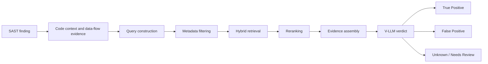

# Sprint 01 — Foundation: Xây dựng nền tảng Security KB

**Người thực hiện:** Nguyễn Như Yến Phương  
**Ngày báo cáo:** 30/07/2026

## Mục lục

1. [Tóm tắt và kết quả crawl](#1-tóm-tắt-và-kết-quả-crawl)
2. [Bối cảnh bài toán](#2-bối-cảnh-bài-toán)
3. [Mục tiêu](#3-mục-tiêu)
4. [Nguyên tắc verdict vulnerability](#4-nguyên-tắc-verdict-vulnerability)
5. [Những loại tri thức cần có trong Knowledge Base](#5-những-loại-tri-thức-cần-có-trong-knowledge-base)
6. [Kiến trúc Knowledge Base và RAG](#6-kiến-trúc-knowledge-base-và-rag)
7. [Nguồn dữ liệu](#7-nguồn-dữ liệu)
8. [Pipeline thu thập dữ liệu](#8-pipeline-thu-thập-dữ-liệu)
9. [Schema đề xuất](#9-schema-đề-xuất)
10. [Đánh giá hệ thống](#10-đánh-giá-hệ-thống)
11. [Phạm vi MVP](#11-phạm-vi-mvp)
12. [Hạn chế và rủi ro](#12-hạn-chế-và-rủi-ro)
13. [Kết luận](#13-kết-luận)
14. [Tài liệu tham khảo](#14-tài-liệu-tham-khảo)

---

## 1. Tóm tắt và kết quả crawl

Sprint này xác định các lớp tri thức cần có để V-LLM không verdict chỉ từ tên rule
hoặc mã GHSA: taxonomy, điều kiện khai thác, affected version, patch, PoC và provenance.

**Kết quả crawl GHSA mẫu:**

- Số advisory đã thu thập: **5**
- Nguồn: **GitHub Advisory Database (reviewed advisories)**
- Thời điểm thu thập: `2026-07-31T08:43:35.179251+00:00`

| Severity | Số lượng |
|---|---:|
| critical | 2 |
| high | 2 |
| low | 1 |

| CWE | Số lượng |
|---|---:|
| CWE-95 | 1 |
| CWE-1188 | 1 |
| CWE-416 | 1 |
| CWE-76 | 1 |
| CWE-918 | 1 |

| Ecosystem | Số lượng |
|---|---:|
| rubygems | 4 |
| npm | 2 |
| pip | 1 |

**Deliverables:** Dataset mẫu tại `data/samples/sprint-01-advisories/`; crawler tại
`scripts/crawl_ghsa.py`.

**Giới hạn:** Sprint này tạo inventory advisory nhưng chưa đủ kết luận source-to-sink
hoặc exploitability — đây là input cho Sprint 02, không phải verdict cuối cùng. Patch
diff, PoC và source/sink/sanitizer nằm trong `data/processed`; dùng
`crawl_github_evidence.py`, `crawl_codeql_models.py` và `transform_to_kb.py` để tạo KB
đầy đủ hơn.

---

## 2. Bối cảnh bài toán

Hiện tại, công ty đang sử dụng một hệ thống multi-agent Static Application Security
Testing (SAST) kết hợp với Vulnerability Large Language Model (V-LLM) để phát hiện và
đánh giá các lỗ hổng trong mã nguồn. Tuy nhiên, V-LLM hiện tại còn thiếu kiến thức
chuyên biệt về bảo mật phần mềm, dễ hallucinate trong quá trình phân tích và đưa ra
nhiều kết quả False Positive.

Báo cáo này nghiên cứu các loại tri thức cần thiết để xây dựng một Security Knowledge
Base (KB), bao gồm: vulnerability taxonomy, bug pattern, source, sink, sanitizer,
propagator, điều kiện khai thác, PoC, bản vá, ví dụ code an toàn và không an toàn,
cùng tri thức riêng của từng ngôn ngữ và framework.

SAST là phương pháp phân tích mã nguồn mà không cần thực thi chương trình nhằm phát
hiện các vấn đề liên quan đến bảo mật, chất lượng và tính đúng đắn của phần mềm.

Một hệ thống SAST truyền thống thường sử dụng:

- Pattern matching.
- Phân tích Abstract Syntax Tree (AST).
- Phân tích Control Flow Graph (CFG).
- Phân tích call graph.
- Data-flow analysis.
- Taint analysis.
- Các security rule được xây dựng thủ công.

Việc kết hợp Large Language Model với SAST giúp hệ thống có khả năng giải thích
finding, suy luận dựa trên ngữ cảnh và phân tích các đoạn code phức tạp hơn. Tuy
nhiên, model có thể đưa ra kết luận không chính xác khi:

- Không có đủ code context.
- Không hiểu semantic của framework hoặc thư viện.
- Không biết API nào là source, sink hoặc sanitizer.
- Không phân biệt được code nguy hiểm với code chỉ có hình thức giống lỗ hổng.
- Không biết các điều kiện cần để lỗ hổng có thể bị khai thác.
- Không có các ví dụ False Positive để đối chiếu.
- Suy diễn thêm các data-flow hoặc control-flow không tồn tại.

Do đó, cần xây dựng một KB chuyên biệt về bảo mật mã nguồn và tích hợp KB này với
V-LLM thông qua RAG.

---

## 3. Mục tiêu

1. Xác định những loại tri thức cần thiết để V-LLM phân tích vulnerability.
2. Xác định các nguồn dữ liệu có thể thu thập từ Internet.
3. Đề xuất cấu trúc dữ liệu phù hợp cho Security KB.
4. Đề xuất kiến trúc RAG phục vụ quá trình verdict.
5. Đề xuất phương pháp đánh giá khả năng giảm False Positive.
6. Xây dựng phạm vi MVP có thể triển khai trong giai đoạn đầu.

---

## 4. Nguyên tắc verdict vulnerability

Một đoạn code sử dụng API nguy hiểm chưa đủ để kết luận rằng code tồn tại
vulnerability. Model cần chứng minh được một đường khai thác hoàn chỉnh.

```
True Positive =
    attacker-controlled source
AND reachable execution path
AND unsafe data/control flow
AND dangerous sink
AND required exploitability conditions
AND no effective sanitizer or guard
AND security impact
```

Verdict nên có ba trạng thái:

- **True Positive:** Có đủ bằng chứng về đường khai thác.
- **False Positive:** Có bằng chứng cho thấy một điều kiện cần không tồn tại hoặc đã
  có cơ chế bảo vệ hiệu quả.
- **Unknown/Needs Review:** Chưa có đủ bằng chứng để kết luận.

Trạng thái Unknown rất quan trọng để tránh model tự suy đoán khi thiếu code context.

---

## 5. Những loại tri thức cần có trong Knowledge Base

### 5.1. Vulnerability taxonomy

KB cần chứa hệ thống phân loại vulnerability dựa trên CWE, CAPEC, OWASP Top 10, ngôn
ngữ lập trình, framework, loại ứng dụng, root cause và security impact. Với mỗi loại,
cần lưu tên, mô tả, nguyên nhân gốc, điều kiện xuất hiện, phương pháp phát hiện, hậu
quả và biện pháp khắc phục.

### 5.2. Bug pattern

Bug pattern mô tả cấu trúc code thường dẫn đến vulnerability. Ví dụ:

```
SQL Injection:       untrusted input → string concatenation → SQL execution
Command Injection:   untrusted input → command construction → shell execution
Path Traversal:      untrusted path → path construction → file access (no canonicalization)
```

Nên lưu dưới cả hai dạng mô tả ngôn ngữ tự nhiên và biểu diễn có cấu trúc theo API/AST/data-flow.

### 5.3. Source

Source là nơi dữ liệu không tin cậy đi vào chương trình (HTTP query parameter, request
body, header, cookie, file upload, message queue, CLI argument, env var, dữ liệu từ
external service không đáng tin cậy). KB cần lưu source theo từng ngôn ngữ và
framework — ví dụ `request.args.get()` của Flask là source dữ liệu do người dùng kiểm
soát.

### 5.4. Sink

Sink là thao tác nhạy cảm có thể gây vulnerability khi nhận dữ liệu không an toàn
(thực thi SQL, system command, đọc/ghi file, render HTML, deserialization, HTTP request
tới URL ngoài, v.v.). Sink phải được liên kết với loại vulnerability cụ thể.

### 5.5. Sanitizer

Sanitizer là thao tác làm dữ liệu an toàn trước khi đến sink (parameterized query,
output encoding, HTML escaping, allowlist validation, path canonicalization, URL scheme
validation, shell=False). Một sanitizer chỉ hợp lệ trong đúng security context — HTML
encoding không ngăn được SQL Injection.

KB cần mô tả sanitizer áp dụng cho vulnerability nào, context sử dụng, điều kiện hiệu
quả và các cách bypass đã biết.

### 5.6. Propagator

Propagator là hàm hoặc phép biến đổi chuyển tiếp dữ liệu tainted. KB cần biết hàm
wrapper nào truyền taint từ input sang output.

### 5.7. Guard và blocking condition

Guard là điều kiện chặn đường khai thác (authentication, authorization, role check,
ownership check, allowlist, bounds check, feature flag). Đây là loại tri thức quan
trọng nhất để giảm False Positive.

### 5.8. Exploitability condition

Phân biệt necessary condition, enabling condition, blocking condition và unknown
condition. Vulnerability chỉ khai thác được khi attacker tiếp cận entry point, kiểm
soát dữ liệu, dữ liệu đến sink và không có cơ chế bảo vệ hiệu quả.

### 5.9. Positive, fixed và negative examples

KB cần có: vulnerable example, fixed example, safe example, hard negative, sanitizer
bypass example, vulnerable/fixed commit pair và regression security test. Hard negative —
code trông giống vulnerability nhưng thực tế an toàn — đặc biệt quan trọng để giảm FP.

### 5.10. Proof of Concept

Record PoC nên bao gồm: vulnerable version/commit, điều kiện môi trường, quyền của
attacker, entry point, payload/request, expected behavior, execution path, security
impact, fixed version, nguồn và độ tin cậy. PoC không được tự động thực thi.

### 5.11. Patch và security test

Cặp vulnerable/fixed code thường có giá trị cao hơn một blog post vì nó chỉ rõ
maintainer đã sửa chính xác phần nào. Cần lưu: vulnerable commit, fixed commit, code
trước/sau, commit message, PR, advisory liên quan, regression test và CWE/CVE.

### 5.12. Framework và library semantics

KB cần tri thức `Language → Framework → Version → API → Security behavior`: ORM method
nào tự parameterize, template engine nào tự escape, middleware nào xác thực, decorator
nào yêu cầu authorization, API nào thay đổi behavior giữa versions.

### 5.13. Tri thức nội bộ của công ty

Custom framework/source/sink, trusted sanitizer, authentication/authorization
architecture, deployment configuration, security coding standard, finding đã được
analyst triage, suppression kèm lý do, threat model và data classification.

---

## 6. Kiến trúc Knowledge Base và RAG



Luồng: SAST scanner tạo finding → query builder trích CWE/language/framework/API/source/sink
→ metadata filter → hybrid search (BM25 + vector) → reranker → V-LLM verdict.

**Hybrid retrieval:** kết hợp keyword/BM25 (CWE, API, identifier chính xác) và vector
search (semantic similarity), metadata filter theo language/framework/version và rerank.
Đơn vị dữ liệu không phải chunk cố định mà là: vulnerability case, source/sink model,
patch pair, API contract, PoC + prerequisites, detection rule + negative examples.

**Verdict output có cấu trúc:**

```json
{
  "verdict": "TRUE_POSITIVE | FALSE_POSITIVE | UNKNOWN",
  "confidence": 0.85,
  "cwe": "CWE-78",
  "source_evidence": [],
  "sink_evidence": [],
  "path_evidence": [],
  "required_conditions": [],
  "blocking_controls": [],
  "counter_evidence": [],
  "missing_evidence": [],
  "citations": [],
  "reasoning_summary": ""
}
```

Model không nên đưa ra verdict chắc chắn nếu không có code evidence hoặc nguồn tri
thức hỗ trợ.

---

## 7. Nguồn dữ liệu

**Nguồn chính thống:** MITRE CWE, CAPEC, OWASP Cheat Sheet Series, GitHub CodeQL
queries, GitHub Security Advisory Database, OSV, NVD, NIST SARD/Juliet Test Suite,
vendor security advisory, security patch và regression test.

**GitHub:** security-fix commit, PR liên quan đến vulnerability, regression test, CodeQL
và SAST rule, Repository Security Advisory, release note, vulnerable/fixed code pair.

**Blog và PoC:** cung cấp root-cause analysis, exploit chain, payload, điều kiện khai
thác và sanitizer bypass — nhưng cần trust score thấp hơn advisory hoặc patch đã xác
minh.

---

## 8. Pipeline thu thập dữ liệu

```
Discover → Fetch → Preserve raw data → Extract structured knowledge → Normalize
→ Link related artifacts → Deduplicate → Assign trust score → Validate → Index
→ Monitor updates
```

Yêu cầu chất lượng: liên kết alias CVE/GHSA/OSV, lưu exact version và commit SHA, phân
biệt vulnerable/fixed code, lưu provenance/URL/author/crawl date/license, đánh dấu
advisory bị withdrawn, version hóa knowledge record, không tự động tin nội dung từ
issue/comment/README, kiểm tra prompt injection trong nội dung crawl.

---

## 9. Schema đề xuất

```json
{
  "knowledge_id": "KB-CWE78-PYTHON-001",
  "type": "detection_pattern",
  "title": "Command injection through shell execution",
  "cwe_ids": ["CWE-78"],
  "languages": ["python"],
  "frameworks": ["flask"],
  "sources": ["flask.request.args.get"],
  "sinks": ["subprocess.run(shell=True)"],
  "sanitizers": ["complete allowlist", "shell=False", "separate command arguments"],
  "propagators": [],
  "required_conditions": [
    "attacker controls the input",
    "input reaches the sink",
    "shell execution is enabled"
  ],
  "blocking_conditions": [
    "complete allowlist is enforced",
    "code is unreachable in production"
  ],
  "positive_examples": [],
  "negative_examples": [],
  "patches": [],
  "pocs": [],
  "references": [],
  "confidence": 0.95,
  "license": "",
  "review_status": "human_verified"
}
```

---

## 10. Đánh giá hệ thống

**Retrieval metrics:** Recall@K, Mean Reciprocal Rank, nDCG, tỷ lệ retrieve đúng CWE,
framework, version, source/sink/sanitizer và patch.

**Verdict metrics:** Precision, Recall, F1-score, False Positive Rate, False Negative
Rate, Recall cho vulnerability nghiêm trọng, Unknown/abstention rate, citation
correctness, reasoning faithfulness, latency và chi phí mỗi finding.

Dataset đánh giá nên được xây dựng từ finding thực tế đã được security analyst xác
nhận, bao gồm cả True Positive, False Positive, safe example, hard negative và trường
hợp thiếu context.

---

## 11. Phạm vi MVP

MVP nên bắt đầu từ phạm vi hẹp:

1. Xác định 5–10 CWE tạo nhiều False Positive nhất.
2. Chọn 1–2 ngôn ngữ được công ty sử dụng nhiều nhất.
3. Chọn các framework chính.
4. Thu thập dữ liệu từ CWE, CodeQL, GHSA, OSV và các security patch.
5. Chuẩn hóa theo KB schema.
6. Xây dựng hybrid retrieval.
7. Tạo benchmark từ finding nội bộ.
8. So sánh kết quả trước và sau khi tích hợp KB.

Deliverable MVP: vulnerability knowledge taxonomy, KB schema, danh mục nguồn, crawler
thử nghiệm, tập vulnerable/fixed/hard-negative examples, hybrid retrieval baseline,
verdict output contract và benchmark.

---

## 12. Hạn chế và rủi ro

- RAG không thể thay thế hoàn toàn static analysis.
- KB chất lượng thấp có thể làm model đưa ra kết luận sai tự tin hơn.
- Blog và PoC có thể chứa thông tin không chính xác.
- Security patch có thể sửa nhiều vấn đề cùng lúc.
- Một số vulnerability phụ thuộc vào runtime configuration.
- Business logic vulnerability khó biểu diễn chỉ bằng source và sink.
- Việc crawl code phải tuân thủ license.
- Nội dung crawl có thể chứa prompt injection.
- False Negative có thể tăng nếu hệ thống quá ưu tiên giảm False Positive.

---

## 13. Kết luận

Để cải thiện khả năng scan code của V-LLM, KB không nên chỉ là một tập CVE, PoC hoặc
bài viết bảo mật được đưa vào vector database. KB cần mô hình hóa đầy đủ vulnerability
taxonomy, bug pattern, source, sink, sanitizer, propagator, guard, exploitability
condition, positive example, negative example, patch, PoC và framework semantics.

Yếu tố quan trọng nhất để giảm False Positive là giúp model kiểm chứng được một đường
khai thác hoàn chỉnh và chủ động tìm kiếm các bằng chứng phủ định như sanitizer,
authorization check hoặc blocking condition.

Kiến trúc phù hợp là sự kết hợp giữa static analysis, Security KB, hybrid retrieval,
evidence-based reasoning và cơ chế trả về Unknown khi chưa đủ bằng chứng.

---

## 14. Tài liệu tham khảo

1. MITRE, "Common Weakness Enumeration": <https://cwe.mitre.org/>
2. MITRE, "Common Attack Pattern Enumeration and Classification": <https://capec.mitre.org/>
3. OWASP, "Secure Code Review Cheat Sheet": <https://cheatsheetseries.owasp.org/cheatsheets/Secure_Code_Review_Cheat_Sheet.html>
4. GitHub, "CodeQL Query Help": <https://codeql.github.com/codeql-query-help/>
5. GitHub, "Global Security Advisories REST API": <https://docs.github.com/en/rest/security-advisories/global-advisories>
6. Google, "OSV API": <https://google.github.io/osv.dev/api/>
7. NIST, "National Vulnerability Database API": <https://nvd.nist.gov/developers/vulnerabilities>
8. NIST, "Software Assurance Reference Dataset": <https://samate.nist.gov/SARD/>
9. Lewis et al., "Retrieval-Augmented Generation for Knowledge-Intensive NLP Tasks," NeurIPS 2020: <https://arxiv.org/abs/2005.11401>
10. GitHub, "CodeQL Repository": <https://github.com/github/codeql>
