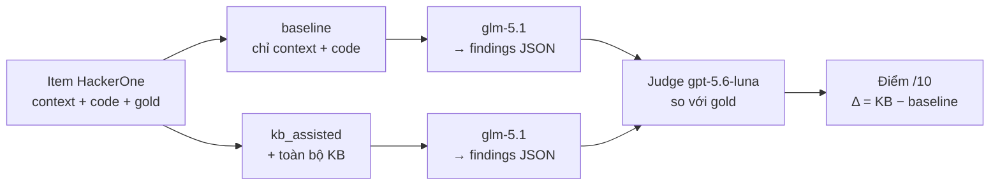

# Benchmark Business Logic KB trên bộ HackerOne

**Ngày thực hiện:** 2026-08-13
**Dữ liệu:** [`dmk1en/business_flaws — items-hackerone`](https://github.com/dmk1en/business_flaws/tree/main/items-hackerone) — 23 tình huống viết bằng Go, TypeScript và Java
**Thiết lập:** 1 lượt/điều kiện, `temperature=0`; responder `glm-5.1`, LLM-as-Judge `gpt-5.6-luna` qua OpenCode API

## Mục lục

1. [Mục tiêu và kết luận](#1-mục-tiêu-và-kết-luận)
2. [Dữ liệu và cách đánh giá](#2-dữ-liệu-và-cách-đánh-giá)
3. [Kết quả KB v1](#3-kết-quả-kb-v1)
4. [Điều chỉnh KB](#4-điều-chỉnh-kb)
5. [Kết quả KB v2](#5-kết-quả-kb-v2)
6. [Giới hạn và hướng tiếp theo](#6-giới-hạn-và-hướng-tiếp-theo)

## 1. Mục tiêu và kết luận

Sprint 05 đã tạo Business Logic KB gồm 24 playbook từ tài liệu PortSwigger và các rule
nội bộ. Benchmark này dùng một bộ dữ liệu bên ngoài (dựng từ các báo cáo HackerOne) để
kiểm tra: **KB có giúp model phân tích source code tốt hơn so với khi chỉ nhận code và
bối cảnh không?**

| Phiên bản KB | Baseline | Có KB | Δ | False Positive (base → KB) |
|---|:--:|:--:|:--:|:--:|
| KB v1 (24 playbook) | 7.39 | 7.30 | **−0.09** | 2 → 3 |
| KB v2 (29 playbook) | 7.26 | 7.30 | **+0.04** | 2 → 4 |

Ở mức toàn dataset, KB **chưa cải thiện ổn định**: v1 hơi làm giảm điểm, v2 gần như ngang
baseline nhưng False Positive tăng. Giá trị thật nằm ở **từng nhóm lỗi**: KB v2 hỗ trợ rõ
cho `over-disclosure` và `missing-authn`, nhưng vẫn gây nhiễu ở `input-invariant` và
`mass-assignment`. Kết luận: **độ phù hợp của playbook quan trọng hơn số lượng playbook**.

## 2. Dữ liệu và cách đánh giá

Mỗi item gồm bối cảnh, các file code **không chứa comment làm lộ lỗi**, và đáp án chuẩn
(`gold`: invariant bị vi phạm, CWE chấp nhận, yêu cầu bản vá, các cách sửa bị cấm, và đoạn
code hợp lệ để bẫy False Positive).

| Thuộc tính bộ dữ liệu | Giá trị |
|---|---|
| Số item | 23 |
| Nhóm lỗi (family) | 8 |
| Ngôn ngữ | Go 11 · TypeScript 6 · Java 6 |

Điểm mấu chốt: KB được viết từ ví dụ Python, nên đây cũng là phép thử **khả năng áp dụng
xuyên ngôn ngữ**. Quy trình chấm hai điều kiện với cùng prompt và cấu hình:

Thang chấm 10 điểm do judge chấm dựa trên `gold`:

| Tiêu chí | Điểm | Ý nghĩa |
|---|:--:|---|
| Phát hiện đúng lỗi | 4 | Đúng file/hàm và nêu đúng invariant bị vi phạm |
| CWE phù hợp | 1 | Nằm trong danh sách CWE chấp nhận |
| Chất lượng bản vá | 3 | Đạt yêu cầu vá, không rơi vào cách sửa bị cấm |
| Không tạo False Positive | 2 | Không báo lỗi ở đoạn code hợp lệ |

KB v1 và v2 chạy ở hai thời điểm riêng, nên baseline cũng dao động (model không hoàn toàn
deterministic). Vì vậy số liệu dùng để **chẩn đoán xu hướng theo nhóm lỗi**, không phải
bằng chứng nhân quả chắc chắn.

## 3. Kết quả KB v1

Với 24 playbook: baseline **7.39**, có KB **7.30**; False Positive tăng **2 → 3**.

| KB hỗ trợ | KB làm kết quả giảm |
|---|---|
| `input-invariant` +2.25 · `missing-authn` +2.00 · `mass-assignment` +1.00 | `over-disclosure` −3.00 · `workflow-state` −1.50 · `rate-invariant` −0.75 |

Phân tích output cho thấy KB **thiếu hoặc mô tả chưa rõ 5 lớp lỗi**. Khi không có playbook
phù hợp, model viện dẫn playbook tổng quát `BL-DOMAIN-INVARIANT-LOGIC-FLAWS` rồi phân tích
lệch trọng tâm hoặc phát sinh cảnh báo sai.

| Lớp lỗi còn trống | Ví dụ hệ quả |
|---|---|
| Object authorization / IDOR | Nhầm hướng phân tích |
| Excessive data exposure | `VF-BL-056`: **8 → 2 điểm** |
| Mass assignment | Bỏ sót hoặc mô tả chung chung |
| Missing authentication | Không nhận ra route thiếu xác thực |
| Fail-open | Bỏ qua nhánh lỗi mở |

## 4. Điều chỉnh KB

Từ các khoảng trống trên, bổ sung **5 playbook ở cấp lớp lỗi**, tổng quát hóa từ MITRE CWE
và OWASP WSTG — **không chứa chi tiết hay đáp án của item benchmark nào**.

| Playbook | Lớp lỗi | Nguồn |
|---|---|---|
| `BL-AUTHZ-OBJECT-REFERENCE-IDOR` | Broken object authorization | CWE-639/863, WSTG-ATHZ-04 |
| `BL-DISCLOSURE-CALLER-CONTROLLED-SCOPE` | Excessive data exposure | CWE-213, WSTG-ATHZ-04 |
| `BL-INPUT-MASS-ASSIGNMENT` | Mass assignment | CWE-915/266 |
| `BL-AUTHN-MISSING-ON-DATA-ROUTE` | Missing authentication | CWE-306, WSTG-ATHN-04 |
| `BL-AUTHZ-FAIL-OPEN-ON-POLICY-ERROR` | Fail-open | CWE-636/390 |

## 5. Kết quả KB v2

Với 29 playbook: baseline **7.26**, có KB **7.30** (`Δ +0.04`). Model viện dẫn ít nhất một
playbook mới ở **9/23 item** (12 lượt, do một item có thể dùng nhiều playbook):

| Playbook mới | Số lượt được viện dẫn |
|---|:--:|
| `BL-AUTHZ-OBJECT-REFERENCE-IDOR` | 4 |
| `BL-DISCLOSURE-CALLER-CONTROLLED-SCOPE` | 3 |
| `BL-AUTHN-MISSING-ON-DATA-ROUTE` | 2 |
| `BL-AUTHZ-FAIL-OPEN-ON-POLICY-ERROR` | 2 |
| `BL-INPUT-MASS-ASSIGNMENT` | 1 |

So sánh Δ theo nhóm lỗi giữa hai phiên bản:

| Nhóm lỗi | Δ v1 | Δ v2 | Nhận xét |
|---|:--:|:--:|---|
| `over-disclosure` | −3.00 | **+3.00** | Sửa được regression lớn nhất của v1 |
| `missing-authn` | +2.00 | **+3.00** | Playbook mới tiếp tục hỗ trợ đúng hướng |
| `workflow-state` | −1.50 | −0.50 | Mức giảm nhỏ hơn nhưng chưa hết |
| `rate-invariant` | −0.75 | 0.00 | Không còn chênh lệch trong lượt chạy này |
| `input-invariant` | +2.25 | **−1.25** | Regression mới, cần phân tích lại |
| `mass-assignment` | +1.00 | **−1.33** | Do 1 item không dùng playbook (xem dưới) |

**Ví dụ tích cực — `VF-BL-056`:** KB v1 làm điểm giảm 8→2 (bám playbook tổng quát); KB v2
viện dẫn `BL-DISCLOSURE-CALLER-CONTROLLED-SCOPE` và đạt **9/10**.

**Mức giảm ở `mass-assignment` KHÔNG do playbook mới sai.** Chi tiết 3 item:

| Item | base → KB | Playbook được dùng | Diễn giải |
|---|:--:|---|---|
| `VF-BL-066` | 0 → **3** | `BL-INPUT-MASS-ASSIGNMENT` (+ IDOR) | Playbook mới **giúp** tăng điểm |
| `VF-BL-067` | 9 → 9 | playbook cũ | Không đổi |
| `VF-BL-068` | 9 → **2** | *(không viện dẫn playbook nào)* | Model tự làm tệ hơn khi nhồi cả KB |

Mức giảm của family đến từ `VF-BL-068` — nơi model **không dùng playbook nào** mà chỉ tụt
điểm, phù hợp với giả thuyết **nhiễu do nhồi toàn bộ KB** chứ không phải lỗi playbook.

Điểm tổng gần như không đổi và False Positive tăng 2→4, nên kết quả chỉ chứng minh
**playbook đúng lớp giúp ích ở một số family**, chưa chứng minh cách nhồi toàn bộ KB vào
context là hiệu quả. Chi tiết 23 item: `hackerone/coverage.json`.

## 6. Giới hạn và hướng tiếp theo

| Giới hạn | Hệ quả |
|---|---|
| Chạy 1 lượt/điều kiện, model + judge dao động | Chênh lệch tổng ±0.1 nằm trong nhiễu, không có ý nghĩa thống kê |
| Nhiều item baseline đã 9–10 | Gần như không còn dư địa cải thiện |
| Nhồi toàn bộ KB vào prompt | Playbook tổng quát cạnh tranh với playbook phù hợp → model dễ chọn sai hướng |
| LLM-as-Judge chưa được đối chiếu tay | Cần chấm thủ công một tập mẫu để hiệu chỉnh |

**Hướng tiếp theo:** dùng **retrieval top-k** thay vì nhồi toàn bộ KB; loại hoặc thu hẹp
`BL-DOMAIN-INVARIANT-LOGIC-FLAWS`; chạy **nhiều lượt lấy trung bình + độ lệch**; chấm thủ
công một tập mẫu; phân tích lại `input-invariant`/`mass-assignment` trước khi mở rộng thêm
nguồn OWASP WSTG và CWE.

**Artifacts:** `scripts/run_hackerone_benchmark.py` và
`data/samples/sprint-05-business-logic-kb/hackerone/{benchmark_runs,benchmark_summary,coverage}.json(l)`;
các file `*.kb_v1.*` giữ kết quả v1 để đối chiếu. Dataset nguồn clone vào `external/` (đã
gitignore, không tái phân phối trong repo).
